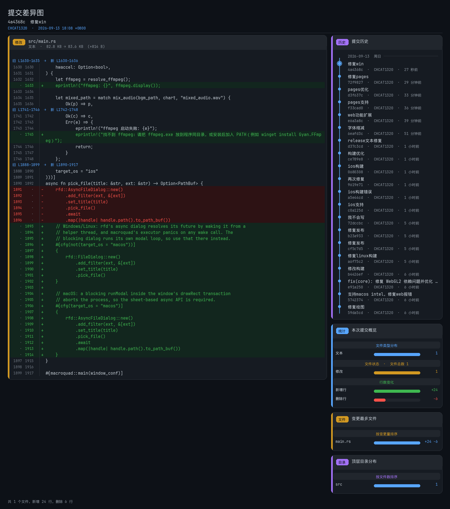
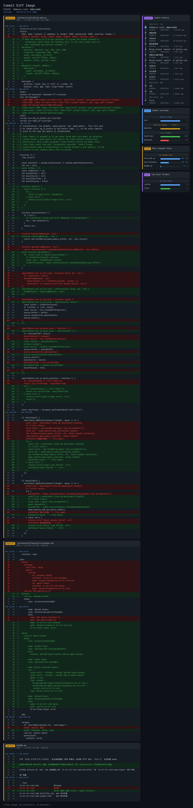

# re-ch-rzl-rust

Rizline 谱面播放 / 录制器。字体和命中音已编入二进制，运行时不依赖 `assets` 目录。

## 用法

播放：

```text
re-ch-rzl-rust.exe [谱面.json] [音频.wav]
re-ch-rzl-rust [谱面.json] [音频.wav]
```

未传路径时会弹出文件选择框。

| 参数 | 说明 |
| --- | --- |
| `--revelation 0.3` | 揭示缩放，默认 `1.0` |
| `--recorder` | 离线渲染视频 |
| `--width` / `--height` / `--fps` | 录制分辨率和帧率 |
| `--hwaccel` / `--no-hwaccel` | 是否使用硬件编码 |

录制模式会先找程序同目录的 `ffmpeg` / `ffmpeg.exe`，找不到再用 PATH。Mac 可用 Homebrew 安装：`brew install ffmpeg`。输出 `output.mp4`。

## 构建

```text
cargo build --release
```

GitHub Actions 会在 `master` 上自动编译 Windows exe 和 macOS 二进制，并生成提交差异图。

## 中文



## English


